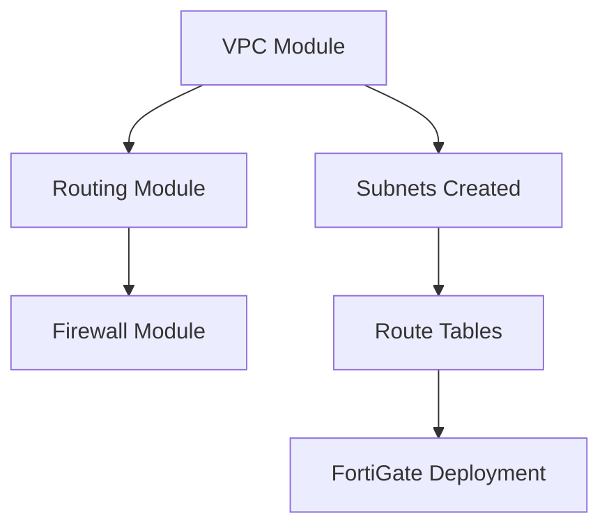

# 🛡️ FortiGate Firewall Module - Deployment Guide

## 🏗️ **Architecture Overview**

### **High Availability FortiGate Deployment**
- **Primary FortiGate**: Active firewall in AZ-1a
- **Secondary FortiGate**: Standby firewall in AZ-1b  
- **HA Mode**: Active-Passive with automatic failover
- **Interfaces**: 4 interfaces per FortiGate (Management, Public, Private, Heartbeat)

### **Network Interface Layout**
```
FortiGate Primary (ap-southeast-7a):
├── port1 (Management) → Management Subnet AZ-7a + EIP
├── port2 (Public)     → Public Subnet AZ-7a + EIP  
├── port3 (Private)    → Private Subnet AZ-7a
└── port4 (Heartbeat)  → Heartbeat Subnet AZ-7a

FortiGate Secondary (ap-southeast-7b):
├── port1 (Management) → Management Subnet AZ-7b + EIP
├── port2 (Public)     → Public Subnet AZ-7b (NO EIP)
├── port3 (Private)    → Private Subnet AZ-7b  
└── port4 (Heartbeat)  → Heartbeat Subnet AZ-7b
```

## 📋 **Prerequisites**

### **1. AWS Key Pair**
Create or verify AWS Key Pair exists:
```bash
aws ec2 describe-key-pairs --key-names fortigate-ssh-instance-key --region ap-southeast-7
```

If it doesn't exist, create it:
```bash
aws ec2 create-key-pair --key-name fortigate-ssh-instance-key --region ap-southeast-7
```

### **2. FortiGate License (Optional)**
- **PAYG (Pay As You Go)**: Default - no license file needed
- **BYOL (Bring Your Own License)**: Requires FortiGate license file

### **3. FortiGate AMI**
Current deployment uses specific AMI: `ami-054e2eb63dc3c2f1b`
- **Fixed AMI**: Ensures consistent deployment across environments
- **Version Control**: Explicit version management instead of dynamic lookup

### **4. VPC Dependencies**
Ensure VPC and routing modules are deployed:
```bash
cd live/network-vpc/vpc && terragrunt apply
cd ../routing && terragrunt apply
```

## 🚀 **Deployment Steps**

### **Step 1: Validate Configuration**
```bash
cd /Users/sevenz/Desktop/Terraform/fss-network-account/live/firewall
terragrunt validate
```

### **Step 2: Plan Deployment**
```bash
terragrunt plan
```

### **Step 3: Deploy FortiGate**
```bash
terragrunt apply
```

### **Step 4: Verify Deployment**
```bash
terragrunt output
```

## 🎛️ **Configuration Options**

### **Instance Size Options**
```hcl
# In terragrunt.hcl locals:
fortigate_instance_type = "c7i.xlarge"    # Current - High Performance (4 vCPU, 8GB RAM, up to 4 ENIs)
# fortigate_instance_type = "c5.large"    # Legacy Standard (2 vCPU, 4GB RAM - limited ENIs)
# fortigate_instance_type = "c5.xlarge"   # Legacy High Performance (4 vCPU, 8GB RAM)
# fortigate_instance_type = "c5.2xlarge"  # Legacy Enterprise (8 vCPU, 16GB RAM)
```

**Note:** Current deployment uses c7i.xlarge which supports up to 4 ENIs required for HA configuration.

### **License Type Options**
```hcl
fortigate_license_type = "payg"  # Pay As You Go (hourly billing)
# fortigate_license_type = "byol"  # Bring Your Own License
```

### **High Availability Control**
```hcl
enable_ha = true   # ✅ Deploy 2 FortiGates in HA mode
# enable_ha = false  # ❌ Deploy single FortiGate only
```

### **Management Access Control**
```hcl
admin_cidr_blocks = [
  "10.120.0.0/16",                 # Current VPC network
  # "203.154.0.0/16",              # External admin network
  # "YOUR_PUBLIC_IP/32"            # Your specific IP
]
```

## 🔐 **Security Groups Created**

### **1. Management Security Group**
- **HTTPS (443)**: FortiGate web management
- **SSH (22)**: CLI access
- **SNMP (161)**: Monitoring
- **Source**: Admin CIDR blocks only

### **2. Public Security Group** 
- **All Traffic (0-65535)**: Internet-facing interface
- **Source**: 0.0.0.0/0 (FortiGate will filter)

### **3. Private Security Group**
- **All Traffic (0-65535)**: Internal network interface
- **Source**: Private networks (10.0.0.0/8, 172.16.0.0/12, 192.168.0.0/16)

### **4. Heartbeat Security Group**
- **All TCP/UDP**: HA synchronization between FortiGates
- **Source**: Self-referencing security group

## 📊 **Expected Outputs**

After successful deployment:

### **Management URLs**
- **Primary FortiGate**: `https://PRIMARY_MGMT_EIP`
- **Secondary FortiGate**: `https://SECONDARY_MGMT_EIP`

### **Public Access**
- **Primary Public EIP**: For internet traffic (active)
- **Secondary Public**: No EIP assigned (HA standby mode)

**Note:** Current configuration has only 1 public EIP on primary FortiGate for cost optimization.

### **Default Credentials**
- **Username**: `admin`
- **Password**: `Tidc@2025` ⚠️ **Change immediately after first login**

### **Instance Information**
- **Primary Instance ID**: `i-xxxxxxxxxxxxxxxxx`
- **Secondary Instance ID**: `i-yyyyyyyyyyyyyyyyy`
- **Public EIPs**: For both management and public interfaces
- **Private IPs**: For all internal interfaces

## 🔧 **Post-Deployment Configuration**

### **1. Initial Setup**
1. **Login** to primary FortiGate web interface
2. **Change default password** immediately
3. **Apply FortiGuard license** (if BYOL)
4. **Configure firewall policies**
5. **Test HA failover**

### **2. Basic Firewall Policies**
```bash
# Example: Allow outbound internet from private networks
config firewall policy
    edit 1
        set name "Private-to-Internet"
        set srcintf "port3"
        set dstintf "port2"
        set srcaddr "all"
        set dstaddr "all"
        set action accept
        set schedule "always"
        set service "ALL"
        set nat enable
    next
end
```

### **3. HA Verification**
```bash
# Check HA status
get system ha status

# Force failover test
execute ha failover set 1
```

## 🔄 **Dependency Order**



**Deployment Sequence:**
1. **VPC** → Creates VPC and all subnets
2. **Routing** → Creates route tables and associations  
3. **Firewall** → Deploys FortiGate instances

## ⚠️ **Important Notes**

### **Costs**
- **c7i.xlarge PAYG**: ~$0.70/hour per instance
- **HA Mode**: 2x instances = ~$1.40/hour total  
- **EIPs**: 3 EIPs (2 management + 1 primary public)
- **Data Transfer**: Additional charges for internet traffic

### **Network Design**
- **Management Interface**: Dedicated for admin access only
- **Public Interface**: Internet-facing with EIP
- **Private Interface**: Internal network connectivity
- **Heartbeat Interface**: HA synchronization only

### **Default Configuration**
- **Password**: Must be changed on first login
- **Firewall Policies**: None configured by default (deny all)
- **HA Priority**: Primary (200), Secondary (100)
- **Session Sync**: Enabled for stateful failover

## 🎯 **Customization Examples**

### **Single FortiGate (No HA)**
```hcl
locals {
  enable_ha = false
  fortigate_instance_type = "c7i.xlarge"
}
```

### **Enterprise Setup**
```hcl
locals {
  enable_ha = true
  fortigate_instance_type = "c7i.2xlarge"
  fortigate_license_type = "byol"
}
```

### **Development/Testing**
```hcl
locals {
  enable_ha = false
  fortigate_instance_type = "c7i.large"
  admin_cidr_blocks = ["YOUR_IP/32"]
}
```

The FortiGate firewall module is now ready for deployment with full HA capabilities! 🛡️
